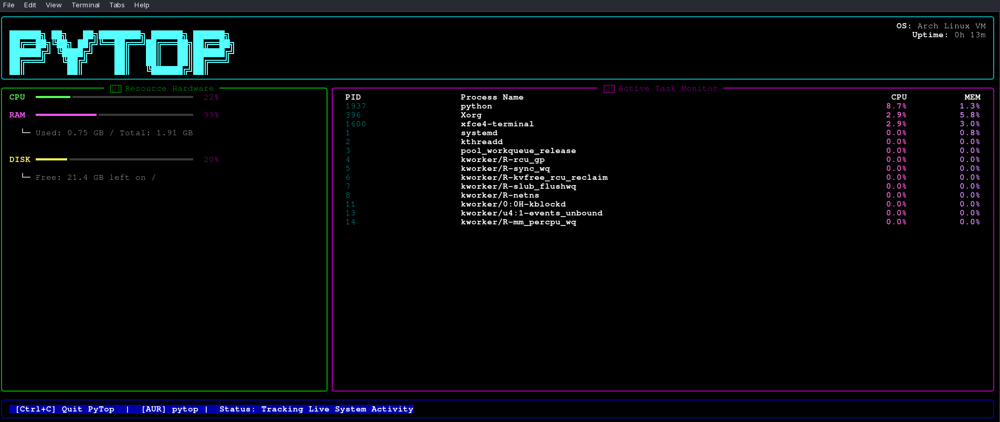

# PyTop 📊


A beautiful, modern, and lightweight terminal resource monitor built for Arch Linux using Python and Rich.

---

## 📸 Preview



---

## ✨ Features

* 🚀 **Real-time Telemetry:** Live tracking for CPU, RAM, and Disk space.
* 📋 **Task Monitor:** View active PIDs, process names, and system footprints.
* 🎨 **Premium UI:** High-contrast neon borders and custom ASCII layouts.
* 🖥️ **Desktop Integrated:** Search and launch directly from your app menu.

---

## 🚀 Installation

### Via AUR (Recommended)
```bash
yay -S pytop
```
From The Source 
```bash
git clone https://github.com/goldstac/pytop.git
cd pytop
python pytop.py
